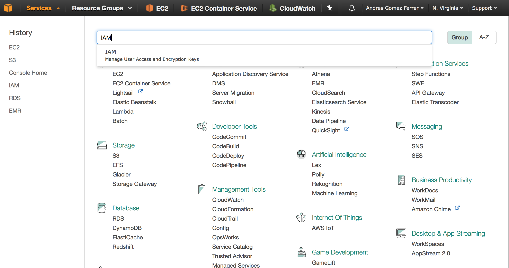
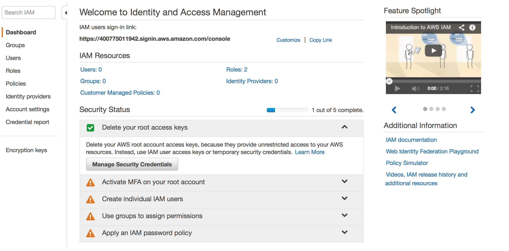
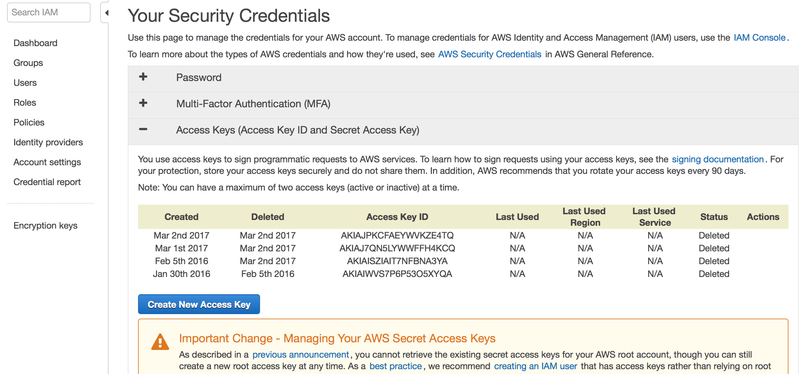
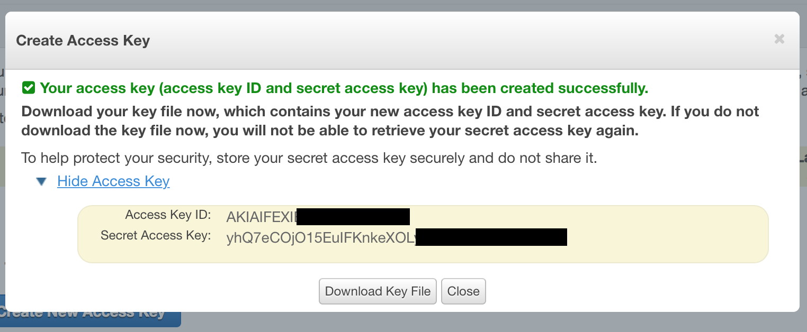
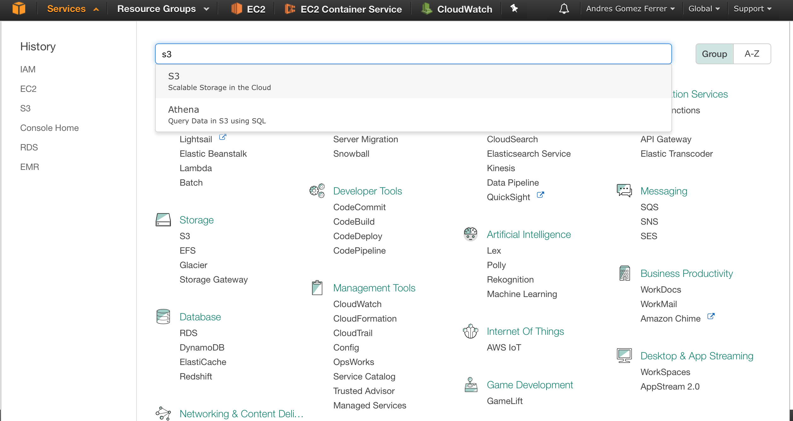
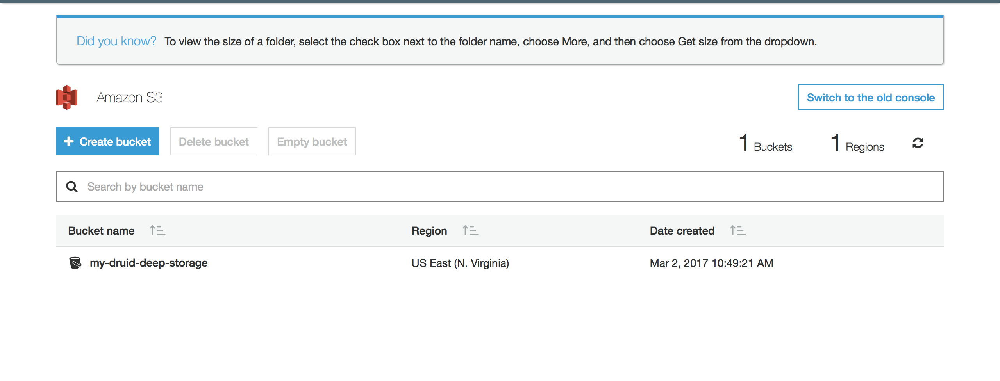
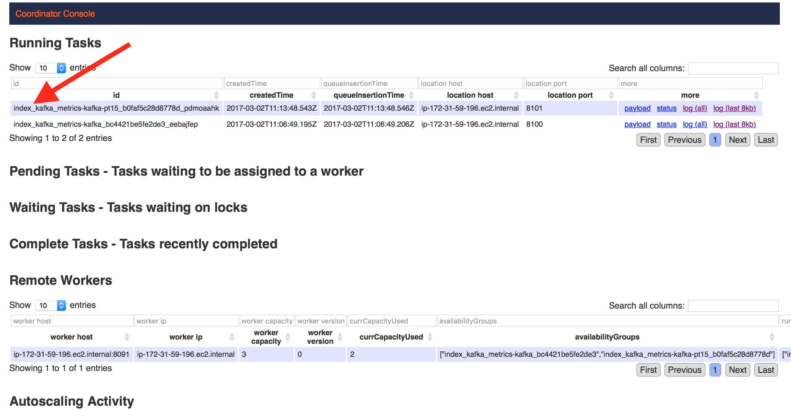
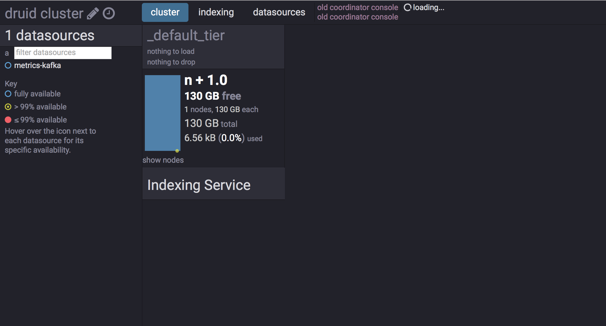
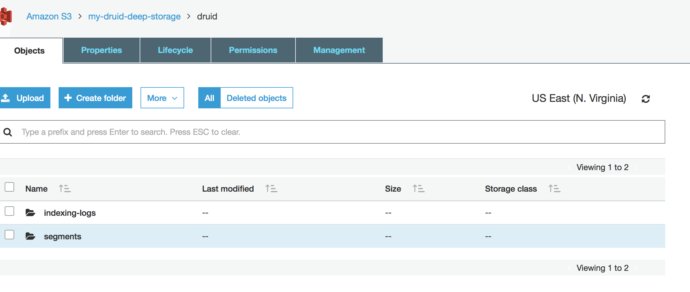

En este tutorial, vamos a instalar un cluster de Druid que podrá funcionar en modo multi-nodo.
El cluster tendrá las siguientes dependencias:

* Deep Storage: S3 AWS
* Metadata Storage: PostgreSQL
* Sincronización: ZooKeeper
* Ingesta de eventos desde Kafka.

## Instalación ZooKeeper y Kafka

[Explicación Kafka](https://github.com/andresgomezfrr/big-data-md/blob/master/kafka/arquitectura/zookeeper-kafka.md)

## Instalación metadata storage (PostgreSQL)

En primer lugar vamos a instalar PostgreSQL.

Ubuntu/Debian

```
apt-get install -y postgresql
```

OSX

```
brew install postgresql
```

Una vez instalado nos cambiamos al usuario del sistema `postgres`, para gestionar la base de datos.

```
su postgres
```

Creamos un nuevo usuario en postgresql de nombre `druid` y le ponemos una contraseña en este caso `diurd`

```
createuser druid -P
```

Creamos una base de datos de nombre `druid` que pertenece al usuario que acabamos de crear.

```
createdb druid -O druid
```

Ya tenemos configurado postgresql y podemos salir del usuario `postgres`.

## Configuración AWS S3

En primer lugar para poder acceder al servicio desde S3 desde Druid se utilizaran un AccessKey y un SecretKey, entonces vamos a generarlos.

1. Accedemos al panel de IAM.


2. Seleccionamos `Manage Security Credentials`.


3. Creamos una nueva Access Key.


4. Visializamos y descargamos las credenciales. Hay que tener en cuenta que no podremos volver a ver nuestro SecretKey desde la consola de AWS, por lo que hay que guardarla.


Una vez ya tenemos nuestras credenciales vamos a crear un Bucket de S3, que utilizaremos como Deep Storage.

1. Accedemos al panel de S3.


2. Seleccionamos crear Bucket, introducimos el nombre del buckey y nuestra region y seleccionamos siguiente, siguiente, siguiente y crear bucket.


3. Finalmente podremos ver nuestro Bucket ya creado.


Con esto ya tenemos configurado nuestro Deep Storage para utilizarlo desde Druid.

## Instalación Druid

En primer lugar descargamos la última versión estable de Druid y la descomprimimos.

```
wget http://static.druid.io/artifacts/releases/druid-0.9.2-bin.tar.gz
```

```
tar -xvf druid-0.9.2-bin.tar.gz
```

Una vez ya tenemos la distribución, lo primero que vamos a hacer es configurar Druid para que use nuestro ZooKeeper y nuestro Deep Storage y Metadata Storage. Para ello editamos el fichero:

```
druid-dist/conf/druid/_common/common.runtime.properties
```

1. Cambiamos las extensiones `druid.extensions.loadList` que utilizaremos en nuestro cluster de Druid. Dejamos las extensiones por defecto, cambiando mysql por postgresql y añadimos la extension de kafka-indexing que usaremos más adelante.
```properties
druid.extensions.loadList=["druid-kafka-eight", "druid-s3-extensions", "druid-histogram", "druid-datasketches", "druid-lookups-cached-global", "postgresql-metadata-storage", "druid-kafka-indexing-service"]
```

2. Configuramos nuestro servidor de ZooKeeper.
```
druid.zk.service.host=localhost:2181
```

3. Comentamos las propiedades de metadata.storage pertenecientes a derby y descomentamos la de postgresql.
Comentamos -->
```
druid.metadata.storage.type=derby
druid.metadata.storage.connector.connectURI=jdbc:derby://metadata.store.ip:1527/var/druid/metadata.db;create=true
druid.metadata.storage.connector.host=metadata.store.ip
druid.metadata.storage.connector.port=1527
```
Configuramos -->
```
druid.metadata.storage.type=postgresql
druid.metadata.storage.connector.connectURI=jdbc:postgresql://localhost:5432/druid
druid.metadata.storage.connector.user=druid
druid.metadata.storage.connector.password=diurd
```

4. Ahora vamos a configurar nuestro Deep Storage, para eso comentamos la parte al deep storage local y descomentamos la parte de S3.
Comentamos -->
```
druid.storage.type=local
druid.storage.storageDirectory=var/druid/segments
```
Configuramos -->
```
druid.storage.type=s3
druid.storage.bucket=my-druid-deep-storage
druid.storage.baseKey=druid/segments
druid.s3.accessKey=AKIAIFEXIBU2R7BA----
druid.s3.secretKey=yhQ7eCOjO15EuIFKnkeXOLyf-----
```

5. Configuramos S3 como almacenamiento de los logs de las tareas de indexación:
Comentamos -->
```
#druid.indexer.logs.type=file
#druid.indexer.logs.directory=var/druid/indexing-logs
```
Configuramos -->
```
druid.indexer.logs.type=s3
druid.indexer.logs.s3Bucket=my-druid-deep-storage
druid.indexer.logs.s3Prefix=druid/indexing-logs
```

Una vez configurado el fichero de `common.runtime.properties` podemos iniciar los servicios y dejar el resto de ficheros con la configuración por defecto.

```
bin/init
```

```
bin/coordinator.sh start
```

```
bin/broker.sh start
```

```
bin/historical.sh start
```

```
bin/overlord.sh start
```

```
bin/middleManager.sh start
```

Todos los logs se encuentran dentro de la carpeta `log`, en el inicio de los servicios debemos indentificar esta linea que significa que el servicio ha iniciado correctamente.

```
2017-03-02T10:53:44,593 INFO [main] org.eclipse.jetty.server.Server - Started @2914ms
```

Una vez todos los servicios se han iniciado deberiamos poder ver sus procesos utilizando:

```
root@ip-172-31-59-196:~/druid# ps aux | grep druid | grep java
root     10736  1.7  1.7 8939096 570460 pts/1  Sl   10:49   0:11 java -server -Xms3g -Xmx3g -Duser.timezone=UTC -Dfile.encoding=UTF-8 -Djava.io.tmpdir=var/tmp -Djava.util.logging.manager=org.apache.logging.log4j.jul.LogManager -Dderby.stream.error.file=var/druid/derby.log -cp conf/druid/_common:conf/druid/coordinator:lib/* io.druid.cli.Main server coordinator
root     10905  2.8  2.1 31731828 693608 pts/1 Sl   10:53   0:11 java -server -Xms24g -Xmx24g -XX:MaxDirectMemorySize=4096m -Duser.timezone=UTC -Dfile.encoding=UTF-8 -Djava.io.tmpdir=var/tmp -Djava.util.logging.manager=org.apache.logging.log4j.jul.LogManager -cp conf/druid/_common:conf/druid/broker:lib/* io.druid.cli.Main server broker
root     11017  6.3  1.6 13598160 542940 pts/1 Sl   10:57   0:09 java -server -Xms8g -Xmx8g -XX:MaxDirectMemorySize=4096m -Duser.timezone=UTC -Dfile.encoding=UTF-8 -Djava.io.tmpdir=var/tmp -Djava.util.logging.manager=org.apache.logging.log4j.jul.LogManager -cp conf/druid/_common:conf/druid/historical:lib/* io.druid.cli.Main server historical
root     11090 11.2  1.7 8924712 573360 pts/1  Sl   10:58   0:09 java -server -Xms3g -Xmx3g -Duser.timezone=UTC -Dfile.encoding=UTF-8 -Djava.io.tmpdir=var/tmp -Djava.util.logging.manager=org.apache.logging.log4j.jul.LogManager -cp conf/druid/_common:conf/druid/overlord:lib/* io.druid.cli.Main server overlord
root     11197 17.4  0.5 4968964 180244 pts/1  Sl   10:59   0:09 java -server -Xms64m -Xmx64m -Duser.timezone=UTC -Dfile.encoding=UTF-8 -Djava.io.tmpdir=var/tmp -Djava.util.logging.manager=org.apache.logging.log4j.jul.LogManager -cp conf/druid/_common:conf/druid/middleManager:lib/* io.druid.cli.Main server middleManager
```

Ahora que ya que tenemos todo el sistema funcionando, vamos a crear una tarea de indexación que consuma de un topic de kafka llamado `metrics` y guarde los datos en un dataSource.

Creamos un fichero con este contenido llamado `kafka-index.json`.

```
{
  "type": "kafka",
  "dataSchema": {
    "dataSource": "metrics-kafka",
    "parser": {
      "type": "string",
      "parseSpec": {
        "format": "json",
        "timestampSpec": {
          "column": "timestamp",
          "format": "ruby"
        },
        "dimensionsSpec": {
          "dimensions": [],
          "dimensionExclusions": [
            "timestamp",
            "value"
          ]
        }
      }
    },
    "metricsSpec": [
      {
        "name": "count",
        "type": "count"
      },
      {
        "name": "value_sum",
        "fieldName": "value",
        "type": "doubleSum"
      },
      {
        "name": "value_min",
        "fieldName": "value",
        "type": "doubleMin"
      },
      {
        "name": "value_max",
        "fieldName": "value",
        "type": "doubleMax"
      }
    ],
    "granularitySpec": {
      "type": "uniform",
      "segmentGranularity": "HOUR",
      "queryGranularity": "NONE"
    }
  },
  "tuningConfig": {
    "type": "kafka",
    "maxRowsPerSegment": 5000000
  },
  "ioConfig": {
    "topic": "metrics",
    "consumerProperties": {
      "bootstrap.servers": "localhost:9092"
    },
    "taskCount": 1,
    "replicas": 1,
    "taskDuration": "PT1H"
  }
}
```

Para ejecutar la tarea de indexación debemos subir el fichero mediante una peticion POST al Overlord.

```
curl -X POST -H 'Content-Type: application/json' -d @kafka-index.json http://localhost:8090/druid/indexer/v1/supervisor
```

Ahora si la tarea se ha levantado podemos verificar que esta funcionando si miramos en la interfaz web del overlod

`http://${OVERLORD_IP}:8090/console.html`



Si tenemos la tarea funcionando correctamente podemos enviar datos utilizando el producer de consola de Kafka.

```
root@ip-172-31-59-196:~# date +%s
1488453335

root@ip-172-31-59-196:~# kafka/bin/kafka-console-producer.sh --broker-list localhost:9092 --topic metrics
{"timestamp":1488453335, "value":20.00, "sensor":"ABC"}
{"timestamp":1488453335, "value":20.00, "sensor":"ABC"}
{"timestamp":1488453335, "value":20.00, "sensor":"ABC"}
{"timestamp":1488453335, "value":20.00, "sensor":"ABC"}
{"timestamp":1488453335, "value":20.00, "sensor":"ABC"}
{"timestamp":1488453335, "value":20.00, "sensor":"ABC"}
{"timestamp":1488453335, "value":20.00, "sensor":"ABC"}
{"timestamp":1488453335, "value":20.00, "sensor":"ABC"}
```

Finalmente podemos realizar una query a los datos indexados para comprobar su funcionamiento.

Query:
```
{
  "queryType": "topN",
  "dataSource": "metrics-kafka",
  "granularity": "all",
  "dimension": "sensor",
  "threshold": 1000,
  "metric": "valueSum",
  "aggregations": [
    {
      "type": "longSum",
      "name": "count",
      "fieldName": "count"
    },
    {
      "name": "valueSum",
      "fieldName": "value_sum",
      "type": "doubleSum"
    }
  ],
  "intervals": [
    "2017-03-02T11:00:00/2017-03-02T11:30:00"
  ]
}
```

```
curl -sX POST http://${BROKER_IP}:8082/druid/v2/?pretty=true -H 'content-type: application/json'  -d @query.json
```

Resultado:
```
[
  {
    "timestamp" : "2017-03-02T11:15:35.000Z",
    "result" :
    [
      {
        "count" : 8,
        "valueSum" : 160.0,
        "sensor" : "ABC"
      }
    ]
  }
]
```

Una vez ya tenemos datos vamos a forzar la creación de un segmento, para ello vamos a apagar la tarea de indexación:

```
curl -X POST -H 'Content-Type: application/json' http://${OVERLORD_IP}:8090/druid/indexer/v1/supervisor/metrics-kafka/shutdown
```

Cuando haya finalizado podemos consultar en la web del Coordinator como ya uno de los historicals tienen segmentos cargados:

```
http://${COORDINATOR_IP}:8081/
```



y podemos veriricar en S3 AWS, que tenemos el segmento y los logs del las tareas de indexación.


